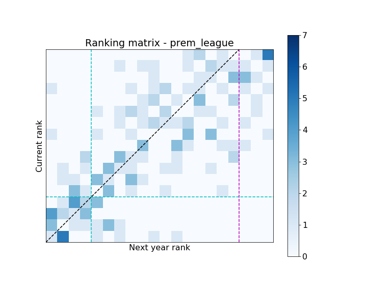
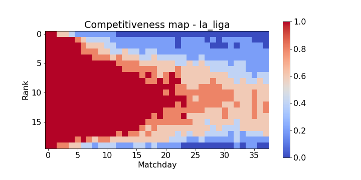

It is a well known belief among football (soccer) fans that the English premier league is superior to other leagues around the world as it is more *competitive*. I am trying to use the data to see put validate this well-held opinion, and possibly quantify it

* TOC
{:toc}
## Year on Year Ranking

I created a matrix which counts the tuple of (rank in current year, rank in next year). I consider the top 17 ranks in the current year,  as the bottom three teams will be relegated. 

Here are the matrices for the first division leagues of England (premier league) and Spain (la liga).

**Description**: The matrix represents the counts of entries for the tuple of ranks. The bottom left cell is the count where the rank for a team was 1 in a year x, and also 1 in the year x+1. The cell to the right is the count of teams which slipped from rank 1 to rank 2 y-o-y.

 The green line marks the spots for champions league, and the red line marks the relegation zone.

#### Observations

* The top four spot has very low competition in la liga
* The rankings in middle of the table do not change very much y-o-y for the premier league
* The premeir league's relegation zone seems more predictable

## Competitiveness Map

For a given team on a match-day, I count the number of teams which are within 2 points. The reasoning behind the number *2* is that the given team can swap rankings with the other team if it is within 2 points. This swaps is what makes a league competition more interesting, day over day.

I normalise the counts by 5, and cap the metric to a max value of 1. Hence, the metric takes a value of 0 is there are no teams within 2 points, 0.2 if there is one other team, and 1 is there are more than 4 teams.

To generate the final map, I take the median value for each team rank and match-day across the years.

  
  

#### Observations

* The top ranks become remain more competitive in the premier league till half the matches are played. After that they are fairly similar
* The third quadrant of the points table is much more competitive in La Liga.
* The relegation zone has higher competition in la liga compared to the premier league